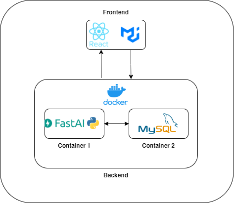

# Task Management App

This project is a task management application built with React for the frontend and a Python backend with Docker for containerization.

## Systems Architecture



## Running the Frontend

To run the frontend, navigate to the `task-management-app` directory and run the following command:

```bash
cd task-management-app
npm install     # Install dependencies
npm run start   # Start the development server
```

The frontend should now be accessible at http://localhost:3000.

## Running the Backend

To run the backend, ensure you have Docker installed on your system. Then, navigate to the `task-management-backend` directory and run the following command:

```bash
cd task-management-backend
docker-compose up    # Start the Docker containers
```

The backend services should now be running and accessible.

## Tech Stack

- Frontend: React
- Backend: Python
- Containerization: Docker
